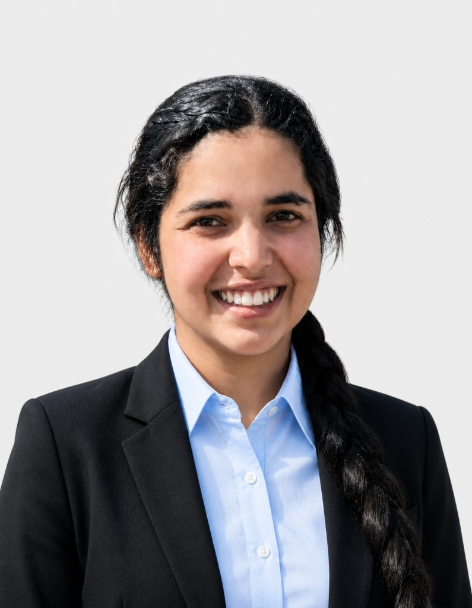

# Hi there, I'm Kanika Chaudhary! 👋

  
    
  

---

### 🧠 About Me

I am a final-year **Computer Science & Engineering (AI/ML)** student at **UPES** and an **Intern at Naiyo** with a bias for action. I specialize in building autonomous agent workflows, advanced RAG systems, and securing full-stack APIs. 🛡️

* 🚀 **Intern** at Naiyo — building tool-calling logic and evaluating ML models.
* 📦 **Shipped products** — designed, built, and deployed live full-stack projects independently.
* 🛠️ **Favorite Stack** — Python, FastAPI, PostgreSQL, LangChain, React, and Ollama.
* 📍 **Target Locations** — Open to AI/ML & Gen AI roles in Bangalore, Noida, and Gurgaon.

---

### 🛠️ Technical Skills

  <!-- AI/ML -->
  

  <!-- Backend / DB -->
  

  <!-- Frontend / Devops -->
  

---

### 🚀 Highlight Projects

* 🧠 **[Mnemosyne](https://github.com/kanikachaudhary70/Mnemosyne)** — Git-integrated AI Memory Hook query layer (Knowledge Graphs + Vector DB + local Llama 3.1).
* 🔒 **[Secure Vault](https://github.com/kanikachaudhary70/secure-vault)** — Full-stack encrypted note & file container built with FastAPI, React, PostgreSQL, and JWT.
* 🌱 **[Smart Soil](https://youtube.com/shorts/Mnh_VC_0WqI?si=FhXWsyIO9Fr9NyK4)** — IoT Soil Fertilizer Recommendation platform using Arduino, ESP32, MQTT, and XGBoost.

---

### 📊 GitHub Analytics

  
  

---

### 🤝 Connect With Me

  
  
  

